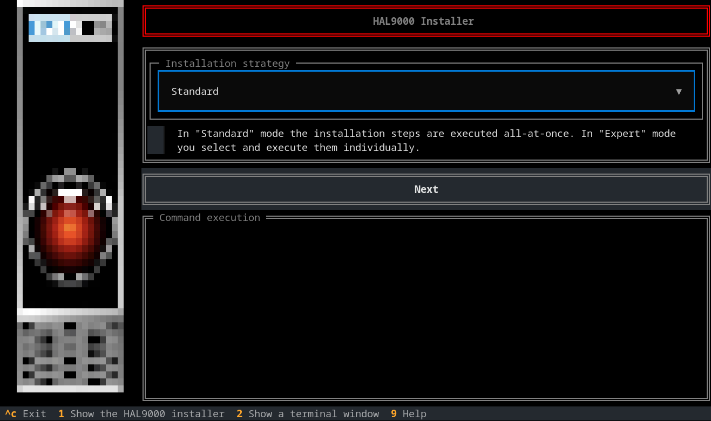
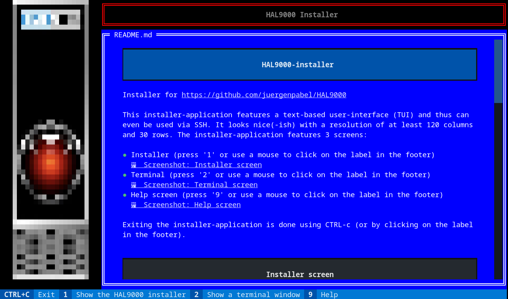

# HAL9000-installer
Installer for https://github.com/juergenpabel/HAL9000

This installer-application features a text-based user-interface (TUI) and thus can even be used via SSH.
It looks nice(-ish) with a resolution of at least 120 columns and 30 rows. The installer-application
features 3 screens:
- Installer (press '1' or use a mouse to click on the label in the footer)  
- Terminal (press '2' or use a mouse to click on the label in the footer)  
- Help screen (press '9' or use a mouse to click on the label in the footer)  

Exiting the installer-application is done using CTRL-c (or by clicking on the label in the footer).

## Installer screen

The Installer screen is used to both install required software and configure the system for running the
HAL9000 application (which runs in containers). The screen is composed of three elements:
- Action selector (which is actually two selectors)
- Execute button
- Execution window

To execute (parts of the) installation process, you select a desired installation (sub-)step in the action
selector (well, either in the system or the application area). When pressing enter (or clicking the
execute-button), the selected installation step(s) are executed in the execution window; depending on the
system state and the executed actions, user input might be required (like entering a password for sudo).
The executed actions can be aborted by clicking the execute button (which is actually an abort-button while
an installer action is being executed).

In the most convinient case, one can select (execute) the top-most item in the action selector areas. In
order to allow for a more fine-grained user-control, most of the sub-elements in the action selectors can
be executed individually. Please note that all sub-elements of the selected element are also queued for
execution (thus: activating a top-most element executes 'everything').

## Terminal screen

The Terminal screen can be used to interactively execute commands while being in the application (and even
while installation commands are being run).

## Help screen

Well, if you're reading this from within the installer-application...you're looking at it.

## FAQ
**Question:** Why (not simply a shell script)?  
**Answer:** Because...I liked the idea (and it took only a few hours to implement). If you really want plain
shell scripts, just run those under the 'scripts/' folder in this repository (in the end, that's almost
just what this installer-application does).

**Question:** The shortcuts (the keys '1', '2' and '9') for switching the screen aren't working, what's wrong?  
**Answer:** Most likely, the focus is inside a (simulated) terminal window (the execution-window on the
installer-screen or the terminal-window on the terminal-screen). Those capture 'regular' input...you might
need to type any of those numbers inside the terminal - use CTRL+F1 to unfocus the terminal-window.

**Question:** I've noticed elements in the action-selector trees before that I don't see anymore?  
**Answer:** Some elements are only inserted into the trees if they are relevant for the system that the
installer-application is being run on. Maybe you ran the installer-application on a different system or
saw screenshots/videos from it being run on a system for which a system-specific element was inserted
(for example: on a Raspberry Pi, an element to install the soundcard driver 'voicecard' is shown).

**Question:** What tools/libraries did you use?  
**Answer:** Foremost: [textual from textualize.io](https://github.com/textualize/textual/); the terminals
are a textual widget ['textual-terminal' from mitosch](https://github.com/mitosch/textual-terminal/); the
HAL9000 image is rendered with ['rich-pixels' from darrenburns](https://github.com/darrenburns/rich-pixels/).

**Question:** Why can't I click on those screenshot and repository links (when shown on the help-screen
inside the installer-application)?  
**Answer:** Well, the textual widget crashes when opening an image resource...so I made a hacky hack to
simply ignore any clicks on them.

