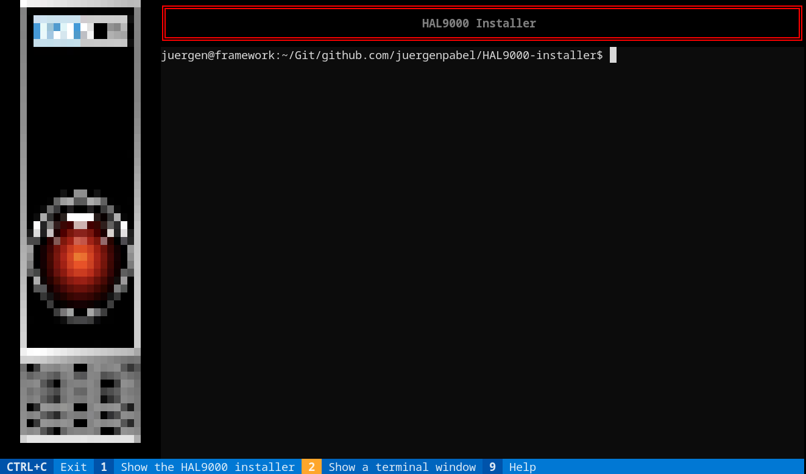

# HAL9000-installer
Installationsprogramm für https://github.com/juergenpabel/HAL9000

`git clone https://github.com/juergenpabel/HAL9000-installer.git`  
`cd HAL9000-installer`  
`./start.sh`  

Dieses Installationsprogramm sollte auf allen (aktuellen) Debian-basierten Linux Systemen funktionieren.
Während der Installation werden benötigte System-Pakete (podman, ...) installiert, es wird ein lokaler
(nicht-privilegierter) Benutzer 'hal9000' (und eine gleichnamige Gruppe) als Applikationsbenutzer
erstellt sowie verschiedene Änderungen an der Systemkonfiguration (Soundkarte, ...) vorgenommen; dann
werden Container-Images runtergeladen (oder neu gebaut). Zuletzt werden die Container zum automatischen
Start während des Systemstarts in per SystemD registriert (in einer Benutzer-Instanz von SystemD unter
dem Benutzer 'hal9000'). Das wäre es im Großen und Ganzen.

Dieses Installationsprogramm nutzt eine text-basierte Benutzer-Oberfläche (TUI) und kann daher auch per
SSH genutzt werden. Ab einer "Auflösung" von 120 Spalten und 30 Zeilen sieht es dann auch ganz passable
aus. Es werden 3 Bildschirmseiten bereitgestellt:
- Installation (über die '1' oder per Maus-Klick in die Fusszeile aufrufbar)
- Terminal (über die '2' oder per Maus-Klick in die Fusszeile aufrufbar)
- Hilfe (über die '9' oder per Maus-Klick in die Fusszeile aufrufbar)

Das Beenden des Installationsprogramms erfolgt über STRG-C (oder per Maus-Klick in die Fusszeile).

## Bildschirmseite: Installation

Die Bildschirmseite 'Installation' wird genutzt um das System auf die Ausführung der HAL9000-Anwendung
(die in Containern erfolgt) vorzubereiten, z.B. Software-Pakete installieren und System-Konfigurationen
vornehmen. Die Bildschirmseite besteht aus drei Elementen:
- Aktionsauswahl (mit zwei Auswahlbereichen)
- Ausführen Schaltfläche
- Ausführungsfenster

Um (Teile des) Installationsprozesses auszuführen, wird ein gewünschter Installations(teil)schritt in der
Aktionsauswahl (also entweder im System- oder im Anwendungsbereich) selektiert und durch Drücken der
Eingabetaste (oder durch Anklicken der Ausführen-Schaltfläche) werden die ausgewählten Installationsschritte
im Ausführungsfenster ausgeführt; je nach Systemzustand und den ausgeführten Aktionen kann eine
Benutzereingabe erforderlich sein (z.B. die Eingabe eines Passworts für sudo). Die ausgeführten Aktionen
können abgebrochen werden, indem man auf die Schaltfläche 'Ausführen' klickt (die eigentlich eine
Abbruch-Schaltfläche ist, während eine Installer-Aktion ausgeführt wird).

Im einfachsten Fall kann man das oberste Element in den Aktionsauswahlbereichen auswählen/ausführen. Um eine
feinere Steuerung zu ermöglichen, können die meisten Unterelemente in den Aktionsauswahlen einzeln ausgeführt
werden. Hinweis: Alle Unterelemente des ausgewählten Elements werden ebenfalls zur Ausführung vorgesehen (d.h. 
die Aktivierung eines obersten Elements führt "alles" darunter aus).

Um (Teile des) Installationsprozesses auszuführen, einfach den gewünschten Installations(teil)schritt in der
Aktionsauswahl (also entweder im System- oder im Anwendungsbereich) auswählen. Durch Drücken der Eingabetaste 
(oder durch Anklicken der Ausführen-Schaltfläche) werden diese Installationsschritte im Ausführungsfenster 
ausgeführt.

## Bildschirmseite: Terminal

Die Bildschirmseite 'Terminal' kann genutzt werden, um interaktiv Kommandos abzusetzen (selbst während der
Ausführung von Installationsschritten).

## Bildschirmseite: Hilfe

Nun ja... hier ist sie.

