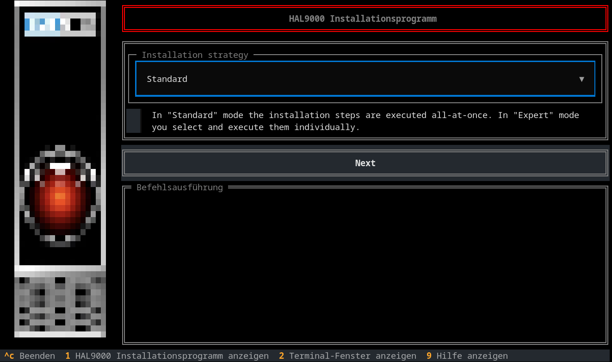
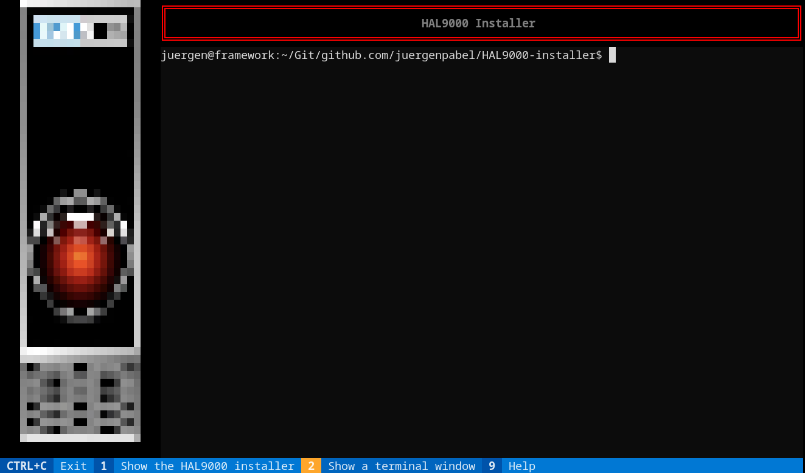
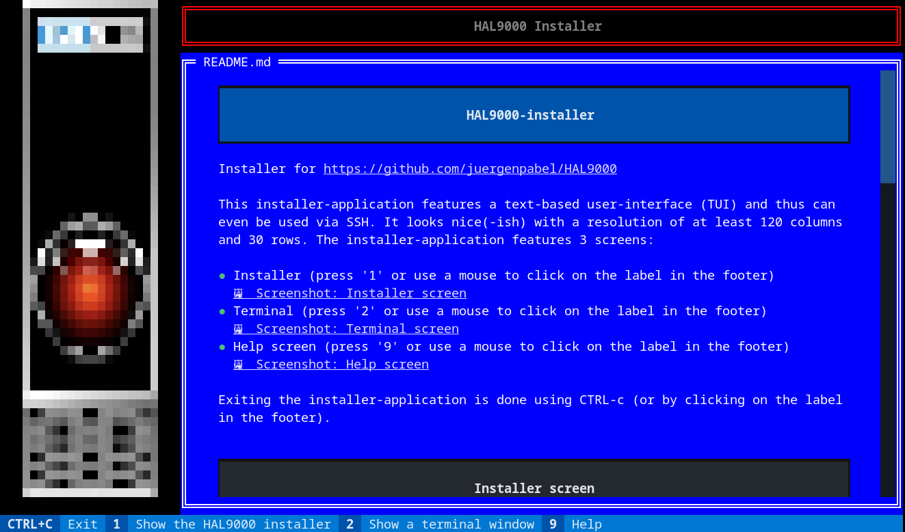

# HAL9000-installer
Installer for https://github.com/juergenpabel/HAL9000

`git clone https://github.com/juergenpabel/HAL9000-installer.git`  
`cd HAL9000-installer`  
`./start.sh`  

**Notice**: When installing on a freshly imaged Raspberry, it's better to run 
`sudo apt update ; sudo apt dist-upgrade -y`
first (and reboot thereafter), as most of the time there's an update for `wpasupplicant` and that 
causes the WIFI connection to reset...and sometimes (at least with my home WIFI setup) to not 
re-connect immediately. It's just a little nuisance but might just be unexpected when it occurs
while the installer is running (making it appear as if it hung) - and that's because the installer
runs those package upgrade commands.

The installer should work on any (recent) Debian-based Linux system. During the installation process it
installs some system packages (podman, ...), creates a local non-privileged user (and group) 'hal9000'
for executing the HAL9000 application in containers, configures various system settings for a uniform
system configuration (soundcard, ...) and downloads (or builds) the container images. At last, it
registers the containers to be run on system startup using a systemd user-instance (for the 'hal9000'
user). That's about it.

This installer-application features a text-based user-interface (TUI) and thus can even be used via SSH.
It looks nice(-ish) with a resolution of at least 120 columns and 30 rows. The installer features 3
screens:
- Installer (press '1' or use a mouse to click on the label in the footer)  
- Terminal (press '2' or use a mouse to click on the label in the footer)  
- Help screen (press '9' or use a mouse to click on the label in the footer)  

Exiting the installer-application is done using CTRL-c (or by clicking on the label in the footer).

## Installer screen

The Installer screen is used to both install required software and configure the system for running the
HAL9000 application (which runs in containers). The screen is composed of three elements:
- Dialog area
- Action button
- Execution window

In the first steps of the installation process, some choices regarding the installation are presented:
- Strategy: "Standard" or "Expert" ("Standard" is recommended because it does everything automatically)
- Sourcing: Whether to download pre-build images or to compile them during the installation
- Version: Which version to download/compile, 'stable' and 'development' are currently supported
- Configuration: Which (demo-)configuration to download (english/german)
- Soundcard: Which soundcard to use (for a Raspberry Zero2W, a driver for the Respeaker 2-mic will be installed)
- Arduino: Which (of the supported) Arduino board is attached (or "None" for exclusive use of the HTTP frontend)

After that (in "Standard" mode) a list of the derived installation are presented in the dialog area and the
action button can be used to start the installation process. The execution of the installation steps will be
shown in the execution window while completed installation steps are marked accordingly in the dialog area.

## Terminal screen

The Terminal screen can be used to interactively execute commands while being in the application (and even
while installation commands are being run).

## Help screen

Well, if you're reading this from within the installer-application...you're looking at it.

## FAQ
**Question:** Why (not simply a shell script)?  
**Answer:** Because...I liked the idea (and it took only a few hours to implement). If you really want plain
shell scripts, just run those under the 'resources/installation-scripts/' folder in this repository (in the end,
that's almost everything this installer-application does).

**Question:** The shortcuts (the keys '1', '2' and '9') for switching the screen aren't working, what's wrong?  
**Answer:** Most likely, the focus is inside a (simulated) terminal window (the execution-window on the
installer-screen or the terminal-window on the terminal-screen). Those capture 'regular' input...you might
need to type any of those numbers inside the terminal - use CTRL+F1 to unfocus the terminal-window.

**Question:** I've noticed elements in the action-selector trees before that I don't see anymore?  
**Answer:** Some elements are only inserted into the trees if they are relevant for the system that the
installer-application is being run on. Maybe you ran the installer-application on a different system or
saw screenshots/videos from it being run on a system for which a system-specific element was inserted
(for example: on a Raspberry Pi, an element to install the soundcard driver 'voicecard' is shown).

**Question:** What tools/libraries did you use?  
**Answer:** Foremost: ['textual' from textualize.io](https://github.com/textualize/textual/); the terminals
are a textual widget ['textual-terminal' from mitosch](https://github.com/mitosch/textual-terminal/); the
HAL9000 image is rendered with ['rich-pixels' from darrenburns](https://github.com/darrenburns/rich-pixels/).

**Question:** Why can't I click on those screenshot and repository links (when shown on the help-screen
inside the installer-application)?  
**Answer:** Well, the textual widget crashes when opening an image resource...so I made a hacky hack to
simply ignore any clicks on them.

